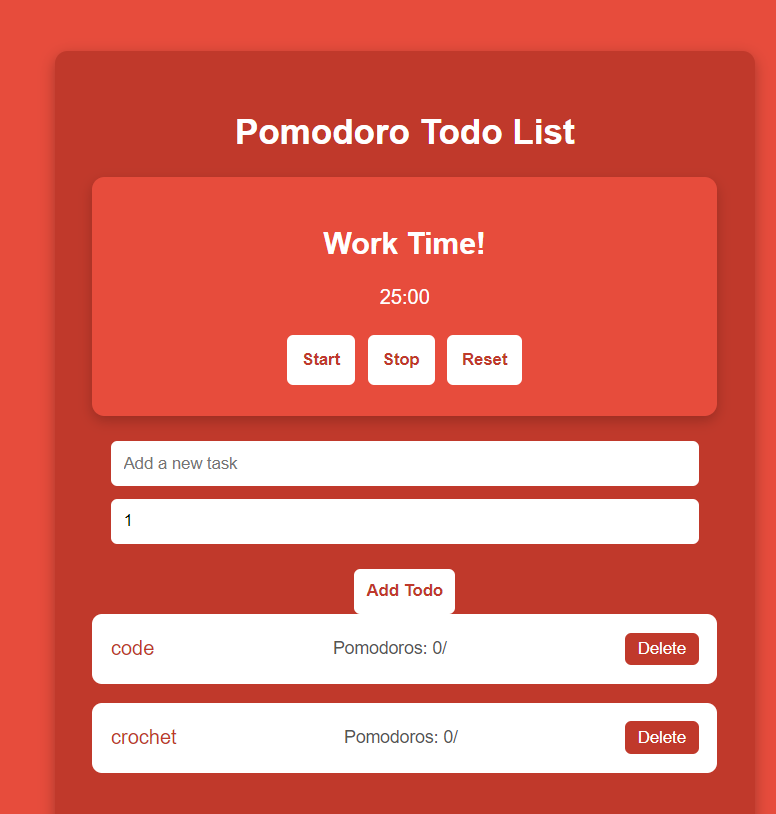
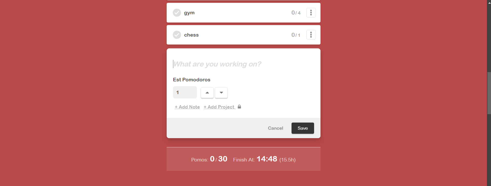
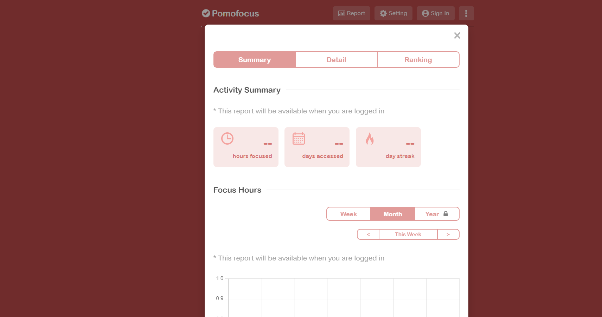

# ⏰ Pomodoro To-Do List ⏰

Welcome to the **Pomodoro To-Do List**! 🎯 This is a simple and beautiful web application designed to help you manage your tasks efficiently with the **Pomodoro Technique**. Whether you're studying, coding, or simply organizing your day, this tool will help you stay productive and on track!



## 📝 Features

- ✅ **Task Management**: Add, delete, and mark tasks as completed.
- 🕑 **Pomodoro Timer**: Timer starts with 25-minute work intervals, followed by a 5-minute break.
- 📊 **Analytics**: Visualize your completed Pomodoros with beautiful charts.
- 🎨 **Customizable Settings**: Adjust the timer, break intervals, and more to suit your workflow!
- 📈 **Reports**: Track your productivity with daily, weekly, and monthly summaries.

## 💻 Screenshots

Here's what the app looks like:

### Main Dashboard 🖥️



### Settings ⚙️

Customize your Pomodoro sessions and breaks to fit your needs:


### Analytics 📊

Get a clear overview of your completed Pomodoros with easy-to-read charts:



## 🚀 Getting Started

To run this project locally, follow these simple steps:

1. **Clone the repository**:
    ```bash
    git clone https://github.com/MohamedBoghdaddy/PomodorToDoList.git
    ```

2. **Install dependencies**:
    ```bash
    npm install
    ```

3. **Run the development server**:
    ```bash
    npm run dev
    ```

4. Open your browser and go to `http://localhost:3000`.

## ⚙️ Technologies Used

- **React.js** ⚛️: Frontend framework
- **Node.js & Express** 🟢: Backend server
- **MongoDB** 🍃: Database for storing tasks and Pomodoro sessions
- **Chart.js** 📊: For visualizing task completion and Pomodoros

## 🤝 Contributions

Feel free to fork this project and submit a pull request. Contributions and suggestions are welcome! 🙌

## 📄 License

This project is licensed under the MIT License. 📜
